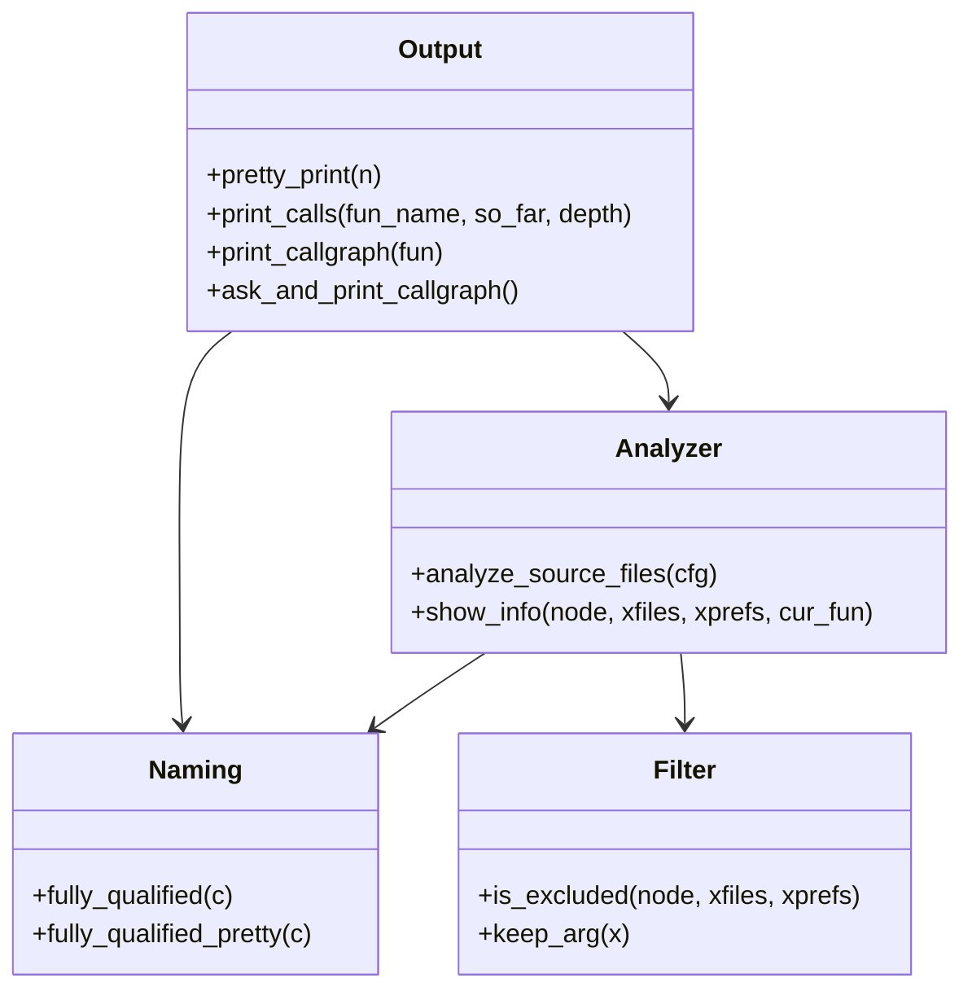
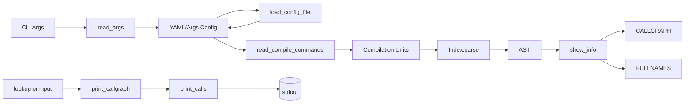
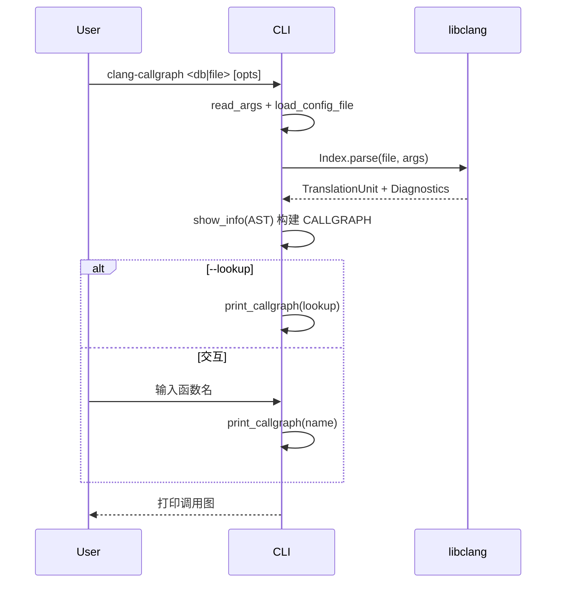

# 架构概览与核心设计

## 技术栈与架构概览
- 语言与运行时：Python ≥ 3.6
- 依赖库：libclang/clang Python 绑定（clang.cindex），yaml（PyYAML）
- 打包与分发：Poetry（pyproject.toml），提供 CLI 入口 `clang-callgraph`
- 操作系统依赖：系统安装 Clang（例如 clang-14 与 libclang-14-dev）

整体架构为单体 CLI 工具：
- 入口函数 `main()` 通过命令行参数解析配置与输入（单个源码文件或 `compile_commands.json` 数据库）
- 使用 libclang 解析翻译单元（TranslationUnit），遍历 AST 构建调用图（CALLGRAPH）与全名索引（FULLNAMES）
- 通过交互或 `--lookup` 直接查询函数并打印其调用关系

## 核心架构设计原则与设计模式
- 高内聚、低耦合：解析、过滤、构图、打印分别由独立函数完成（如 `read_args`、`is_excluded`、`show_info`、`print_calls`）。
- 单一职责：各函数职责清晰（读取配置、读取编译数据库、AST 遍历、输出格式化）。
- 关注分离：命令行解析与配置合并（`read_args`/`load_config_file`）与语义处理逻辑（libclang AST 访问）分离。
- 防御式编程：诊断信息检查，限定最大递归深度（15）。
- 设计模式：
  - 访问者/遍历模式：`show_info` 递归访问 AST 节点收集调用边。
  - 外观模式（简化调用）：`print_callgraph` 封装查询与输出。
  - 策略式过滤：通过前缀与路径列表作为过滤策略（`is_excluded`）。

## 模块划分与主要组件交互
- 参数与配置层：
  - `read_args(argv)`：解析 CLI 参数，返回配置字典（包含排除前缀/路径、clang 额外参数、配置文件与 lookup）。
  - `load_config_file(cfg)`：加载 YAML，合并 `clang_args`、`excluded_prefixes`、`excluded_paths`。
- 数据采集层：
  - `read_compile_commands(filename)`：读取单文件或 `compile_commands.json`。
  - `analyze_source_files(cfg)`：创建 libclang Index，解析 TU，遍历诊断与 AST。
- 分析构图层：
  - `fully_qualified/fully_qualified_pretty`：生成符号全名用于唯一标识与输出友好显示。
  - `is_excluded(node, xfiles, xprefs)`：基于路径/前缀过滤符号与调用。
  - `show_info(node, ...)`：在 AST 遍历时，识别方法/函数/模板与调用表达式，填充 CALLGRAPH 与 FULLNAMES。
- 展示交互层：
  - `pretty_print(node)`：标注虚函数信息。
  - `print_calls(fun_name, so_far, depth)`：深度优先打印调用链，防止循环与过深递归。
  - `print_callgraph(fun)`：根据查询词在 CALLGRAPH 或 FULLNAMES 中打印。
  - `ask_and_print_callgraph()`：交互式查询循环。
- 入口：
  - `main()`：串联全流程，控制是否交互。

### 主要组件交互方式
1. `main` 调用 `read_args` → `load_config_file` → `analyze_source_files`。
2. `analyze_source_files` 使用 libclang 解析源码，遍历 AST 时调用 `show_info`，填充 `CALLGRAPH`/`FULLNAMES`。
3. 根据 `--lookup` 或交互输入，`print_callgraph` 和 `print_calls` 输出结果。

## 架构图示（Mermaid）

### 框架图
```mermaid
flowchart TD
    A[CLI: main()] --> B[read_args]
    A --> C[load_config_file]
    A --> D[analyze_source_files]
    D --> E[libclang Index.parse]
    E --> F[AST Cursor]
    F --> G[show_info 收集 CALL_EXPR]
    G --> H[(CALLGRAPH)]
    G --> I[(FULLNAMES)]
    A --> J{模式}
    J -->|--lookup| K[print_callgraph]
    J -->|交互| L[ask_and_print_callgraph]
    K --> M[print_calls]
    L --> M
```

### 类/关系图


### 数据流图


### 生命周期图

